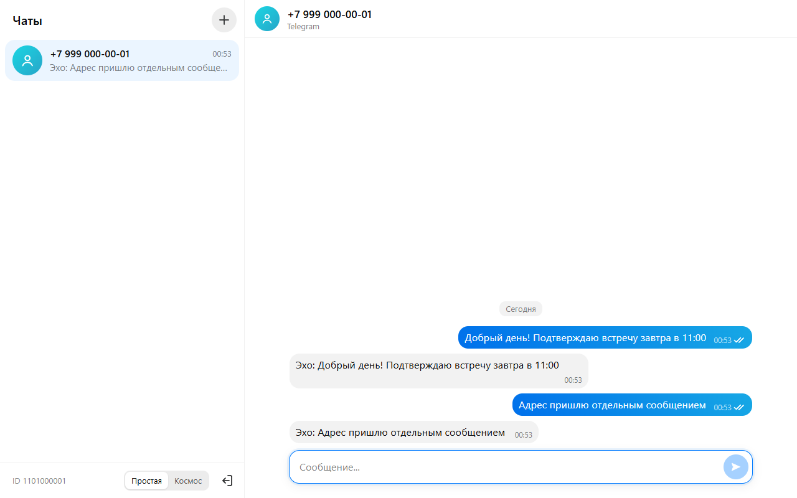
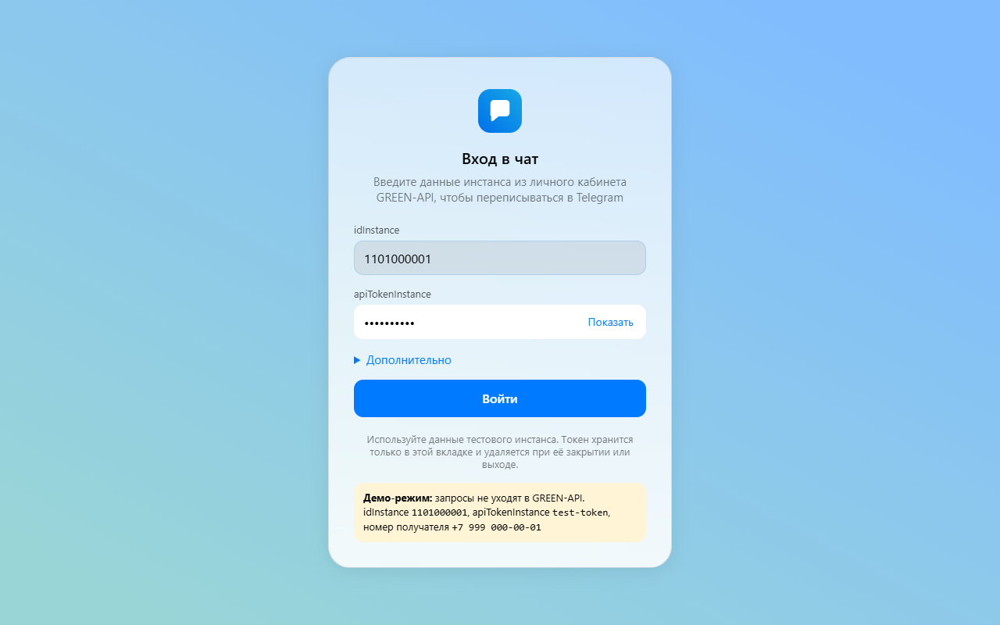
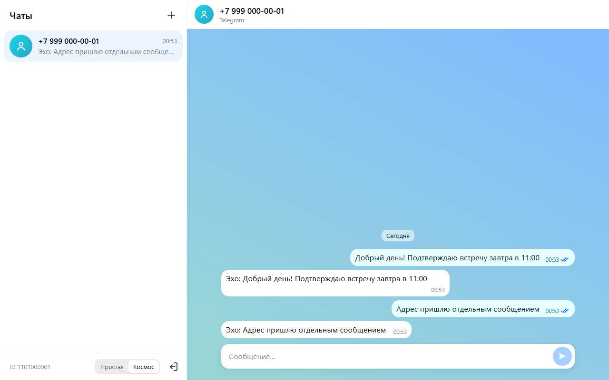
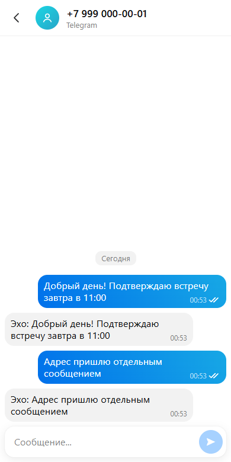

# Чат Telegram через GREEN-API

Веб-интерфейс для отправки и получения текстовых сообщений Telegram через [GREEN-API](https://green-api.com/telegram/). Внешний вид повторяет веб-версию мессенджера MAX ([web.max.ru](https://web.max.ru/)).

**Рабочая версия:** https://lamardav.github.io/green-api-telegram-chat/. Войдите с `idInstance` и `apiTokenInstance` своего тестового инстанса Telegram.

**Стек:** React 19 · TypeScript (strict) · Vite 8 · CSS Modules · Vitest + Testing Library · oxlint · Prettier. Бэкенда нет: браузер обращается к GREEN-API напрямую, CORS это разрешает.



| Вход                                | Тема «Космос»                                     | Телефон                                          |
| ----------------------------------- | ------------------------------------------------- | ------------------------------------------------ |
|  |  |  |

<sub>Скриншоты сделаны в демо-режиме (`npm run dev:mock`): там встроенный симулятор отвечает эхом на каждое сообщение.</sub>

## Сценарий

1. Пользователь вводит `idInstance` и `apiTokenInstance` своего инстанса.
2. Нажимает «+», вводит номер получателя и создаёт чат.
3. Пишет сообщение и отправляет его (`SendMessage`).
4. Получатель отвечает в Telegram.
5. Ответ появляется в чате (HTTP API: `ReceiveNotification` + `DeleteNotification`).

Кроме этого:

- у отправленных сообщений видны статусы: отправляется, отправлено, доставлено, прочитано, ошибка с кнопкой «Повторить»;
- сообщение от нового собеседника само создаёт чат со счётчиком непрочитанных;
- история сохраняется при перезагрузке страницы;
- на экранах уже 768 px интерфейс переходит в одну панель;
- две темы оформления: «Простая» и «Космос».

## Запуск

Нужен Node.js 22.12 или новее.

```bash
npm ci
npm run dev        # http://localhost:5173, настоящий GREEN-API
npm run dev:mock   # демо без GREEN-API: встроенный симулятор отвечает на каждое сообщение
```

Данные для демо-режима показаны прямо на экране входа:

- `idInstance` — `1101000001`;
- `apiTokenInstance` — `test-token`;
- номер получателя — `+7 999 000-00-01`.

| Скрипт            | Назначение                                     |
| ----------------- | ---------------------------------------------- |
| `npm run build`   | Production-сборка в `dist/`                    |
| `npm run preview` | Локальный просмотр сборки                      |
| `npm test`        | Тесты (Vitest, jsdom)                          |
| `npm run check`   | Всё сразу: типы, линтер, форматирование, тесты |

## Подготовка инстанса GREEN-API

1. В [личном кабинете](https://console.green-api.com/) создайте инстанс Telegram. Тарифа «Разработчик» достаточно.
2. Авторизуйте его по QR-коду: Telegram → Настройки → Устройства → Подключить устройство.
3. Войдите в приложение. Если в настройках инстанса задан `webhookUrl` или выключены уведомления, приложение покажет баннер «Включить получение». Кнопка вызывает `SetSettings`:
   - `webhookUrl: ""`;
   - `incomingWebhook: "yes"`;
   - `outgoingWebhook: "yes"`.

   Инстанс при этом перезапускается, настройки применяются в течение 5 минут. Если в настройках был задан webhook, баннер показывает его адрес и предупреждает, что он будет отключён.

## Безопасность

- **Вводите данные только тестового инстанса и тестового аккаунта Telegram.** `apiTokenInstance` даёт полный доступ к аккаунту.
- Токен хранится в `sessionStorage`: живёт до закрытия вкладки и удаляется кнопкой «Выйти». Приложение не пишет его в свои логи, в URL страницы и в `localStorage`.
- Формат API GREEN-API требует передавать токен в пути запроса. Поэтому он виден во вкладке Network DevTools, а при ошибке запроса браузер сам печатает этот URL в консоль. Третьим сторонам токен не передаётся: приложение не загружает внешних скриптов, шрифтов и аналитики, а `<meta name="referrer" content="no-referrer">` исключает утечку через Referer.
- В production-сборке действует Content Security Policy: скрипты и стили только с собственного домена, запросы только по HTTPS. `apiUrl` принимается только с `https://` (`http://` разрешён лишь для `localhost`). Параметры в пути запроса экранируются.
- Текст сообщений выводится как текст, HTML не интерпретируется.
- История переписки хранится в `localStorage` отдельно для каждого `idInstance`, до 500 последних сообщений на чат. «Выйти» удаляет её с устройства. Если браузер откажется сохранять (хранилище переполнено или отключено), приложение предупредит об этом.

## Решения и отступления от ТЗ

| Тема           | Решение                                                                                                            | Почему                                                                                                                                                                                                         |
| -------------- | ------------------------------------------------------------------------------------------------------------------ | -------------------------------------------------------------------------------------------------------------------------------------------------------------------------------------------------------------- |
| Мессенджер     | Telegram вместо MAX                                                                                                | ТЗ допускает WhatsApp или Telegram                                                                                                                                                                             |
| Внешний вид    | Токены web.max.ru: цвета, радиусы, типографика, раскладка                                                          | Прототип по п.4 ТЗ. Логотип и фирменные иллюстрации MAX не используются                                                                                                                                        |
| Номер → чат    | `CheckAccount` → `chatId`, затем `SendMessage` по `chatId`                                                         | В Telegram `chatId` — числовой ID. Входящие приходят с ним, а номер отправителя часто скрыт. Без `CheckAccount` ответ нельзя надёжно связать с чатом. Отправка по `номер@c.us` к тому же тратит квоту отдельно |
| `apiUrl`       | Вычисляется из `idInstance` (`https://{первые 4 цифры}.api.green-api.com`), можно переопределить в «Дополнительно» | По ТЗ форма содержит два поля. Правило хоста не задокументировано, поэтому оставлено ручное поле                                                                                                               |
| Проверка входа | `GetStateInstance` при входе, `GetSettings` сразу после                                                            | Понятная ошибка при неверном токене или неавторизованном инстансе. Без нужных настроек получение молча не работало бы                                                                                          |
| Типы сообщений | Только текст (`textMessage`, `extendedTextMessage`) из личных чатов                                                | Требование ТЗ. Остальные уведомления удаляются из очереди, чтобы она не останавливалась                                                                                                                        |
| Номер телефона | Международный формат, 10–15 цифр, без автозамены 8 → 7                                                             | Telegram международный, автозамена испортила бы иностранные номера                                                                                                                                             |
| Старая очередь | Уведомления, накопившиеся до входа, обрабатываются                                                                 | Это реальные входящие сообщения                                                                                                                                                                                |

## Архитектура

```
src/
  api/        HTTP-клиент GREEN-API, классификация ошибок, разбор уведомлений (без React)
  domain/     модель чатов и чистый reducer, телефон, apiUrl, время, аватары
  services/   цикл опроса очереди, безопасная работа с storage, блокировка между вкладками
  state/      контексты сессии и чатов и хуки: сохранение, настройки инстанса, опрос, вкладки
  components/ UI; каждый компонент со своим CSS-модулем
  mocks/      симулятор GREEN-API для тестов и демо-режима
  styles/     дизайн-токены и глобальные стили
```

- **Клиент API** получает `fetch` через параметр. Поэтому тесты и демо-режим используют один и тот же симулятор, а в production-сборку он не попадает (проверено по `dist`).
- **Получение сообщений.** Один цикл long polling (`receiveTimeout=20`). Уведомление удаляется из очереди только после того, как событие передано в состояние приложения. Если удалить не удалось, GREEN-API пришлёт уведомление повторно, а дубль отсекается по `idMessage`. Сетевые ошибки обрабатываются с экспоненциальной паузой (1 → 30 с, с джиттером). У каждого запроса есть таймаут, у long polling — `receiveTimeout` + 10 с. При неверном токене приложение возвращается на экран входа, история при этом сохраняется. В течение 5 минут после включения уведомлений ошибка «задан webhook» считается временной: инстанс ещё применяет настройки.
- **Статусы** только повышаются (прочитанное не станет «доставленным»). Статус, пришедший раньше ответа `SendMessage`, запоминается и применяется позже.
- **Порядок в ленте.** Свои сообщения всегда добавляются в конец. Входящие ставятся раньше существующих, только если они старше их больше чем на минуту: так обрабатывается накопившаяся очередь. Время у GREEN-API с точностью до секунды, часы сервера и клиента расходятся, поэтому по одному времени сортировать нельзя.
- **Несколько вкладок.** Чат работает в одной вкладке: она одна читает очередь и сохраняет историю. Иначе вкладки делили бы уведомления между собой и затирали историю друг друга. Остальные вкладки показывают «Чат открыт в другой вкладке» с кнопкой «Открыть здесь». Если активную вкладку закрыть, ожидающая становится активной сама. Реализовано на Web Locks API; без него (сайт открыт по `http://` не с `localhost`) вкладки не координируются.
- **Прерванная отправка.** Сообщение, которое отправлялось в момент закрытия или перезагрузки страницы, восстанавливается как неотправленное с кнопкой «Повторить» и подсказкой сначала проверить, не дошло ли оно.
- **Устойчивость интерфейса.** Ошибка рендеринга показывает экран «Что-то пошло не так» вместо пустой страницы. Пузыри сообщений и элементы списка мемоизированы: смена статуса одного сообщения не перерисовывает всю ленту.

## Тесты

`npm test` запускает модульные тесты API-клиента, парсера уведомлений, reducer, цикла опроса и хранилища, а также тесты компонентов. Приёмочный тест `src/App.test.tsx` проходит сценарий из ТЗ через интерфейс на симуляторе. Симулятор проверяется против настоящего клиента, чтобы они не разошлись.

## Деплой

Workflow `.github/workflows/pages.yml` собирает проект и публикует его на GitHub Pages. Запускается вручную (Actions → Deploy to GitHub Pages → Run workflow), перед этим нужно включить Pages с источником «GitHub Actions» в настройках репозитория.

Приложение — статический SPA, его можно разместить на любом хостинге: `npm run build`, затем раздать содержимое `dist/`. Если сайт открывается не из корня домена, путь задаётся переменной `VITE_BASE`.

## Ограничения

- Бесплатный тариф «Разработчик»: переписка только с 3 чатами, 100 проверок номера (`CheckAccount`) в месяц. При превышении показывается понятная ошибка.
- Если получатель скрыл номер в настройках приватности Telegram, найти его по номеру нельзя.
- История хранится только в этом браузере. Переписка, которая была до входа или велась с телефона, не загружается: получение ограничено HTTP API по ТЗ.
